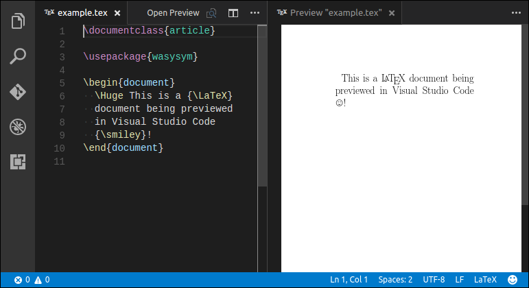

# VSCode Latex Preview Extension

## Features

* Inline preview of LaTeX documents, automatically updated on save.
* Generate VSCode build tasks for LaTeX documents.
* Click on a document position to go to the relevant source code.
* Use a context menu item to go from source code to a preview document position.

## Usage

Open a `.tex` file, and then click the "Open Preview" button in the title bar. This will open a preview rendering which
is updated when you save the document. To go from a source code location to a preview location, select "Show in Preview"
in the editor context menu. You can also click on the preview document to go to the corresponding source code.

To generate a VSCode build task to run `pdflatex`, run the "LaTeX: Create Build Task" command.

## Commands

* **LaTeX: Create Build Task** Prompts to select a `.tex` file and creates a task in `tasks.json` to build it using `pdflatex`.
* **LaTeX: Show Preview** Opens a preview of the current document in a new tab. The preview updates when the document is saved.
* **LaTeX: Show Preview to Side** Opens a preview in a column alongside the current document.
* **LaTeX: Show in Preview** Jumps to the current cursor position in the preview document.
* **LaTeX: Show Source** Shows the source document for the current preview.
